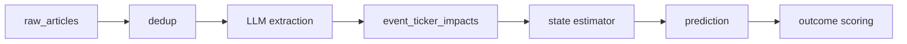

# Constitution

This file lists the **deal-breaker behaviors** of the news-impact market state estimator — the promises that, if broken, mean reverting the whole PR without reading further. It is the ungameable layer the elves Judge checks every batch, so the agent (which writes both the code and the tests) cannot satisfy the letter of a test while missing the point.

Promises are stated as **behaviors**, abstract enough to survive refactoring, specific enough to verify against the diff. Implementation detail belongs in `PLAN.md` (§5 Invariants, §15 Standards), not here.

---

## Flows

Pipeline flows that must hold end to end.

- **Closed loop.** Every persisted prediction is eventually joined to a realized outcome row (or marked unscoreable with a reason). A prediction that lands in the table without a path to a future outcome is a bug.
- **Evidence trace.** For every prediction in the database it is possible to reconstruct, from persisted rows alone, the chain *article → extracted claims with quotes → impact fields → state snapshot → features → prediction*. No link in the chain may be implicit.
- **LLM never decides trades.** The LLM extracts evidence. The filter updates beliefs. The predictor estimates impact. The portfolio/risk layer (when it exists) decides whether to act. No code path lets an LLM output directly determine a trade or alert priority.

## Business logic — discipline invariants

The promises below correspond to the lettered invariants in `PLAN.md` §5. The PR is rejected if any is violated.

- **As-of discipline (I1, I8, I10).** A prediction made at time `t` never uses data with `published_at_utc > t` or `scraped_at_utc > t`. The realized abnormal return scored against that prediction uses only returns from `(t, t+h]`. There is no code path that reads "future" rows under any condition.
- **Reproducibility (I3).** Every persisted prediction reconstructs byte-identical from its recorded `(model_version, prompt_version, feature_snapshot_id, state_snapshot_id, event_ids, market_data_version)`. A prediction whose inputs cannot be recovered from the database alone is a bug.
- **No silent fallback (I5).** An extraction, ingestion, or filter failure is never replaced by a neutral or default value silently. Every failure produces a typed error log entry and a skipped row; "default neutral" states are explicitly marked when they exist by design.
- **Replay determinism (I7).** Running the pipeline over `[t0, t1]` as a backfill produces the same state snapshots as the forward run did over the same window. A change that breaks replay determinism without an explicit, documented reason is rejected.
- **Single writer per state row (I2).** Only the state estimator writes `ticker_state_snapshots`. Only the covariance updater writes `covariance_snapshots`. No other code path mutates these tables.
- **Bounded LLM cost (I4).** Daily LLM spend never exceeds the configured budget. An exceeded budget halts extraction with a typed error; it never silently drops events or substitutes a cheaper model without an audited config change.
- **PSD covariance (I6).** Every persisted covariance or correlation snapshot is positive semi-definite. A write that would violate PSD is rejected at write time, not patched after.
- **Conservative dedup (I9).** A near-duplicate that adds materially new information is never merged into a prior event. Dedup precision is preferred over recall.

## Invariants — system-level

- **Timestamps are UTC and unambiguous.** No row that influences a prediction stores a local-time string, a naive timestamp, or an unparseable date. `as_of_time_utc` (or the equivalent `*_at_utc` column) is non-null on every such row.
- **Schema validation is mandatory.** An LLM extraction with an invalid schema never becomes an `events` row with `extraction_status = 'ok'`. It either retries to a valid schema or lands in `extraction_failures` with a typed error code.
- **Universe gate.** Predictions and state writes are only emitted for tickers in the configured universe (NVDA-only for Slice 0; Nasdaq 100 from M1). Off-universe data may be ingested but never produces a prediction row.
- **No look-back rewrite.** Past `ticker_state_snapshots`, `predictions`, and `outcomes` rows are append-only. A correction is a *new* row with a new `snapshot_id`, never an in-place mutation, never a delete-and-reinsert.
- **Cost meter is live.** The daily LLM spend counter is written to the database (not just to logs) on every extraction call. A cost meter that can be silenced or muted by a config flag is a bug.

---

## How the Judge reads this

The Judge fetches the constitution and the batch diff each cycle, then issues a verdict per promise: **PASS / WARN / FAIL / UNCHANGED**. Any `FAIL` blocks the batch from advancing. A `WARN` is logged but does not block.

When a promise here changes, change it deliberately — bump the version, write the reason in the commit, and update `PLAN.md` §5 to match. The constitution and the plan invariants are the same promises stated for two audiences (the Judge here, the implementer there); they must not drift.
