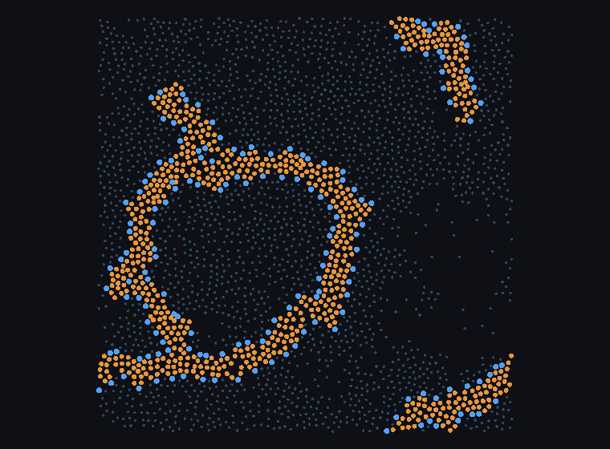

# Emergent vesicle in a 2-D transformer-only lipid model

**Claim.** A closed, water-filled bilayer vesicle self-assembles from a dispersed random start,
persists under fresh thermal noise, and passes a two-gate criterion calibrated against known
structures. Nothing was planted at any point in its lineage.

**It formed by ends meeting, not by curvature.** That distinction is the main scientific content
here, and it is measured, not assumed.



---

## The criterion

A single enclosure count is not sufficient — a branched network with an incidental pocket passes it.
`vesicle_call()` requires both:

1. **`n_enclosed == 1` at every dilation in bead 1.0–3.0.** The count is dilation-sensitive, so only a
   call stable across the knob is reportable.
2. **The lumen must be the right SIZE for the lipid count.** A closed vesicle of *n* lipids has contour
   *n*, so *R = n/2π* and interior *πR²*. Threshold 0.10.

Calibration, every entry verified against its render:

| structure | lumen / expected | verdict |
|---|---|---|
| planted vesicle, N = 120 | 0.876 | vesicle |
| planted ring, N = 300 | 0.882 | vesicle |
| implicit arc, N = 80, closed | 0.295 | vesicle (irregular) |
| **emergent candidate** | **0.269–0.292** | **vesicle** |
| emergent branched network | 0.028 | not a vesicle |
| branched network, later reading | 0.010–0.044 | not a vesicle |

Gate 2 exists because the original pre-registered criterion had only gate 1, and a 160-lipid branched
network passed it. The render caught that; the metric did not.

## The result

Lineage: random dispersed start → N = 160, L = 65 → continued twice. No planting anywhere.

| | |
|---|---|
| largest cluster | **160/160** lipids |
| percolating | no |
| core depth | 1.430–1.440 |
| `n_enclosed` @ bead 1.0/1.5/2.0/3.0 | 1, 1, 1, 1 |
| lumen ratio | 0.269–0.292 |

**Persistence** — 5 fresh thermal seeds, 200 000 steps, read at the end:

| seed | largest | vesicle_call | ratio |
|---|---|---|---|
| 20 | 159 | True | 0.272 |
| 21 | 160 | True | 0.285 |
| 22 | 160 | True | 0.281 |
| 23 | 123 | True — **fragmented, excluded** | 0.454 |
| 24 | 160 | False (opened) | — |

**3/5 intact and True**, against a bar of ≥3/5 fixed before the run. The source trajectory
independently held its closure for a further 400 000 steps (2.4 M total, ratio 0.292).

## Why it closed: encounter, not curvature

**This force field cannot curve a flat bilayer.** Every candidate source was tested on the same
planted-flat-ribbon protocol, and every one is a measured null with the membrane intact:

| candidate | result |
|---|---|
| χ_TW (tail–water) | null **with power**: λ = +2.8 ± 2.8 vs −5.2 ± 4.2 ε |
| χ_HH (head–head) | 0/5 at two values, 10 runs |
| lipid shape (2-tail) | dissolves to micelles, largest 7–11 of 80 |
| leaflet **thickness** asymmetry (4/6 tails) | 0/5, intact, render straight |
| leaflet **area** asymmetry (split 0.58, ratio 1.35) | 0/5, intact |

The reason is structural: χ terms are symmetric pair interactions, and spontaneous curvature is by
definition a difference between the two leaflets.

Closure instead happens when two ends of a ribbon meet. **In the emergent run this is visible directly
in the trajectory**, not just inferred from the planted arcs:

| step | largest | n_enclosed | lumen | ratio |
|---|---|---|---|---|
| 320 000 | 116 | 0 | 0 | — |
| **360 000** | **116** | **1** | **2145** | **0.501** |
| 400 000 | 160 | 1 | 2191 | 0.269 |

The vesicle closed at **116 lipids** at **constant size** — 116 before, 116 after — which is what two
ends meeting looks like, and is not what accretion bridging a gap would look like. It then absorbed the
remaining ~44 lipids, which added appendages and no lumen, diluting the raw ratio from 0.501 to 0.269.
**The appendages are post-closure accretion, and the shell was at its best the moment it formed.**

The same route is quantified in planted arcs at fixed N = 300, varying only the end-gap:

| end-gap | closed |
|---|---|
| 2.4 σ (N = 80) | 5/5, all by step 5 000 |
| 3.0 σ | 5/5 |
| 6.0 σ | 3/5 |
| 9.0 σ | 2/5 |

A rate that falls steeply with gap, with **no hard capture radius** — even 9 σ closes given time. The
emergent vesicle is this process at work: a long meandering ribbon whose ends found each other.


*A planted flat bilayer after 200 000 steps with imposed 4/6-tail leaflet asymmetry: still straight,
fully intact. 0/5 closed.*

## Limits

- **It is a vesicle with appendages, and the split is measured.** `shell_split()` counts which lipids
  line the lumen. Of 160 lipids, **~101 form the shell and ~59 are attached material**. Correcting the
  expectation for that, the shell alone reads **0.662-0.714** against **0.876** for a planted vesicle
  -- so the raw 0.28 understates shell quality by about 2.5x. `reach` is calibrated on a planted
  vesicle, which must return (120, 0): 2.5 gives 98/22 because it reaches only the inner leaflet,
  5.0 is where the control comes out clean.

  | structure | total | shell | appendage | raw | corrected |
  |---|---|---|---|---|---|
  | planted vesicle N=120 (control) | 120 | 120 | 0 | 0.876 | 0.876 |
  | emergent, persistence sd21 | 160 | 101 | 59 | 0.285 | 0.714 |
  | emergent, persistence sd22 | 160 | 102 | 58 | 0.281 | 0.691 |
  | emergent, frozen candidate | 160 | 102 | 58 | 0.269 | 0.662 |

  **The appendages are passengers, not load-bearing** -- settled with 10 seeds per condition, scored on
  the fraction of checkpoints closed over a common step range rather than on a single endpoint:

  | condition | closed fraction | never closed |
  |---|---|---|
  | bare 102-lipid shell | 0.594 +- 0.141 | 2/10 |
  | full 160-lipid object | 0.565 +- 0.119 | 0/10 |

  Difference **-0.029 +- 0.184, i.e. 0.2 sigma.** Deleting the 58 appendage lipids does not destabilise
  the closure, so the corrected ratio describes a self-supporting object. (An earlier version of this
  section claimed the opposite from a 5-seed endpoint read in which one seed was scored mid-run; that
  is withdrawn.)

  An independent check of `shell_split` fell out of building that state: with the appendages gone the
  RAW ratio is 0.656-0.657, which is the CORRECTED ratio computed with them present (0.662).
- **It is 2-D.** Nothing transfers to 3-D, where explicit solvent at phi 0.15-0.35 is still fragmented
  droplets rather than a liquid.
- **The appendaged form is a kinetic trap, not a preferred morphology.** Real vesicles do bud and
  tubulate, so the shape is not by itself disqualifying -- but in this model it is measurably NOT the
  favoured state. A planted single 160-ring, same lipids and conditions, sits at **-7.502 +- 0.023**
  eps/lipid against the emergent structure's **-7.158 +- 0.033**: the emergent form is **+55 +- 6 eps
  (122 kT) higher, at 8.5 sigma**, and the single ring encloses ratio 0.76-0.85 against 0.28. Real
  budding is driven by excess area at fixed enclosed volume and by spontaneous curvature; this model
  has no volume constraint and, measured five different ways, no spontaneous curvature at all.
- **The formation rate is unmeasured.** One occurrence in five emergence seeds. A 10-seed measurement
  is in flight and stands at **0/10 at 50-65% of its runs**; until it finishes this is "observed once",
  not "reproducible at rate X".
- **It does not improve with time.** Over 600 000 steps and five seeds the composition is static --
  shell 100-110, appendages 50-60 -- and one seed degraded outright (shell 26, lumen 45). The shell
  closed at ratio 0.501 and was at its best the moment it formed.

## Reproducing

```bash
bazel build //projects/vivarium:_mixture
# dispersed start, N=160 in L=65
OMP_NUM_THREADS=1 VIVARIUM_CHI_HT=-0.25 VIVARIUM_CHI_WW=0.50 \
  bazel-bin/projects/vivarium/_mixture 1600000 2 160 0.0 65.0 0.45 0.55 random <seed>
```

Score any saved state with `vesicle_call()` in `_lumen_field.py`. The frozen candidate is
`docs/states/vesicle_candidate_frozen.npz`.

Full chronology, including every retraction, is in [AUTONOMOUS_LOG.md](AUTONOMOUS_LOG.md).
